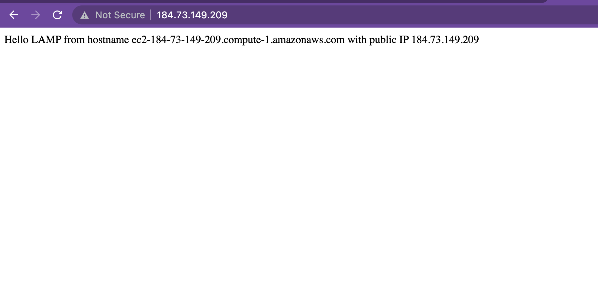

# WEB STACK IMPLEMENTATION IN AWS

## LAMP STACK 


In this Project, we will be implementing Linux, Apache, MySQL, and PHP (LAMP) in six easy steps. 

## Prerequisites 
- An AWS Account 
- Basic understanding of Linux (chown & chmod commands)
- basic text editing skills in vi

### Step 1 - Launch an EC2 Instance

- Launch a new EC2 Instance with t2 micro family and with Ubuntu Server 20.04 LTS

- Create a new keypair - * It is important to save your private key (.pem file) securely *

- ensure you allow ssh traffic into your instance from ** Anywhere ** 


### Connect to your EC2 Instance (using MAC/Linux)

- open your terminal and cd into the directory where your .pem file is saved.
- to avoid a "bad permission" error, change the permissions for the private key file by running:

` sudo chmod 0400 <private-key-name>. pem `

- connect to your instance by running:

` ssh -i <private-key-name>. pem ubuntu@<Public-IP-address> `

Great! We've just launched our instance and connected to it, our set up looks like this now: 


### Step 2 - Installing Apache and updating the firewall

> Install Apache using Ubuntu’s package manager * apt *

- update a list of packages in package manage by running

`sudo apt update`

- run apache2 package installation 

`sudo apt install apache2`

- To verify that apache2 is running as a Service in our OS, use following command

`sudo systemctl status apache2`

*if it is green and running, then you did everything correctly - Yaay! You have just launched your first Web Server in the Clouds*


Before we can receive any traffic by our Web Server, we need to open TCP port 80 which is the default port that web browsers use to access web pages on the Internet

- To do this, we need to go back to our AWS console and add a rule to our EC2 instance configuration to open inbound connection through port 80:


Our server is running and we can access it locally and from the Internet *(Source 0.0.0.0/0 means ‘from any IP address’)*.

Now let us check how we can access our server locally in our Ubuntu shell, run:

`curl http://localhost:80`

You should get something like this:


Now it is time for us to test how our Apache HTTP server can respond to requests from the Internet. Open a web browser of your choice and try to access following url http://<Public-IP-Address>:80


Your browser should look like this:


## Step 3 - Installing MySQL

Now that we have a web server up and running, we need to install a Database Management System (DBMS) to be able to store and manage data for our site in a relational database.

- to install the software, run: 

`sudo apt install mysql-server`

- When prompted, confirm installation by typing Y, and then ENTER.

- When the installation is finished, log in to the MySQL console by typing:

`sudo my sql`


*It’s recommended that you run a security script that comes pre-installed with MySQL. This script will remove some insecure default settings and lock down access to your database system. Before running the script, you will set a password for the root user, using mysql_native_password as default authentication method. We’re defining this user’s password as PassWord.1.*


- Exit the MySQL shell with:


- Start the interactive script by running:

`sudo mysql_secure_installation`

- Answer Y for yes, or anything else to continue without enabling.


*If you answer “yes”, you’ll be asked to select a level of password validation. Keep in mind that if you enter 2 for the strongest level, you will receive errors when attempting to set any password which does not contain numbers, upper and lowercase letters, and special characters, or which is based on common dictionary words e.g., PassWord.1*


*For the rest of the questions, press Y and hit the ENTER key at each prompt. This will prompt you to change the root password, remove some anonymous users and the test database, disable remote root logins, and load these new rules so that MySQL immediately respects the changes you have made.*

- Now log in to the MySQL console by typing:

`sudo mysql -p`

- To exit the MySQL console, type `exit`

Great! MySQL server is now installed and secured. In the next step, we will install PHP, the final component in the LAMP stack.


## Step 4 - Installing PHP 

*We now have Apache installed to serve our content and MySQL installed to store and manage our data.* 

*PHP is the component of our setup that will process code to display dynamic content to the end user. In addition to the php package, you’ll need php-mysql, a PHP module that allows PHP to communicate with MySQL-based databases. You’ll also need libapache2-mod-php to enable Apache to handle PHP files. Core PHP packages will automatically be installed as dependencies.*

- To install these 3 packages at once, run:

`sudo apt install php libapache2-mod-php php-mysql`

- Once the installation is finished, we need to confirm our PHP version by running: `php -v`


At this point, your LAMP stack is completely installed and fully operational.

- Linux (Ubuntu)
- Apache HTTP Server
- MySQL
- PHP

*We are not done yet though, we have just a few more steps to go*

## Step 5 - Creating a virtual host for our website using apache

In this step, you will set up a domain called ***projectlamp***, but you can replace this with any domain of your choice.

- Create the directory for projectlamp using ‘mkdir’ command as follows:

`sudo mkdir /var/www/projectlamp`

- Next, assign ownership of the directory with your current system user:

`sudo chown -R $USER:$USER /var/www/projectlamp`

- Create and open a new configuration file in Apache’s sites-available directory using your preferred command-line editor.

`sudo vi /etc/apache2/sites-available/projectlamp.conf`

- This will create a new blank file. Paste in the following bare-bones configuration by hitting on i on the keyboard to enter the insert mode, and paste the text:

``` 
<VirtualHost *:80>
    ServerName projectlamp
    ServerAlias www.projectlamp 
    ServerAdmin webmaster@localhost
    DocumentRoot /var/www/projectlamp
    ErrorLog ${APACHE_LOG_DIR}/error.log
    CustomLog ${APACHE_LOG_DIR}/access.log combined
</VirtualHost>
```

- To save and close the file, hit the escape button, type: **:wq**, then hit enter.

- We can use the ls command to show the new file in the sites-available directory

`sudo ls /etc/apache2/sites-available`

- You can now use a2ensite command to enable the new virtual host:

`sudo a2ensite projectlamp`

*You might want to disable the default website that comes installed with Apache. This is required if you’re not using a custom domain name, because in this case Apache’s default configuration would overwrite your virtual host.* 

- To disable Apache’s default website use a2dissite command, type:

`sudo a2dissite 000-default`

- To make sure your configuration file doesn’t contain syntax errors, run:

`sudo apache2ctl configtest`

- Finally, reload Apache so these changes take effect:

`sudo systemctl reload apache2`


*Our new website is now active, but the web root /var/www/projectlamp is still empty.* 

- Lets create an index.html file in that location so that we can test that the virtual host works as expected:

`sudo echo 'Hello LAMP from hostname' $(curl -s http://169.254.169.254/latest/meta-data/public-hostname) 'with public IP' $(curl -s http://169.254.169.254/latest/meta-data/public-ipv4) > /var/www/projectlamp/index.html`

- Now let's go to our browser and try to open our website URL using IP address:

`http://<Public-IP-Address>:80`

You should see somthing like this:



*You can leave this file in place as a temporary landing page for your application until you set up an index.php file to replace it. Once you do that, remember to remove or rename the index.html file from your document root, as it would take precedence over an index.php file by default.*

## Step 6 - Enabling PHP on the website 

With the default DirectoryIndex settings on Apache, a file named index.html will always take precedence over an index.php file.In case you want to change this behavior, you’ll need to edit the /etc/apache2/mods-enabled/dir.conf file and change the order in which the index.php file is listed within the DirectoryIndex directive:

`sudo vim /etc/apache2/mods-enabled/dir.conf`

- clear everything and paste this in: 

```
<IfModule mod_dir.c>
        #Change this:
        #DirectoryIndex index.html index.cgi index.pl index.php index.xhtml index.htm
        #To this:
        DirectoryIndex index.php index.html index.cgi index.pl index.xhtml index.htm
</IfModule>
```
- After saving and closing the file, you will need to reload Apache so the changes take effect:

`sudo systemctl reload apache2`

- Create a new file named index.php inside your custom web root folder:

`vim /var/www/projectlamp/index.php`

- This will open a blank file. Add the following text inside the file:

```
<?php
phpinfo();
```

- When you are finished, save and close the file, refresh the page and you will see a page similar to this:


# Congratulations!!! Our PHP installation is working as expected

This page provides information about your server from the perspective of PHP. It is useful for debugging and to ensure that your settings are being applied correctly.

- After checking the relevant information about your PHP server through that page, it’s best to remove the file you created as it contains sensitive information about your PHP environment -and your Ubuntu server. You can use rm to do so:

`sudo rm /var/www/projectlamp/index.php`

You can always recreate this page if you need to access the information again later.


## Bonus Step

### Now stop or terminate your instance and any other resources to avoid additional charges.


# Goodluck!