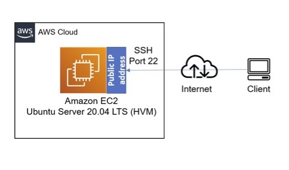
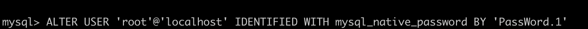
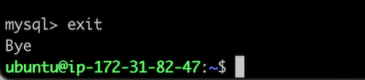
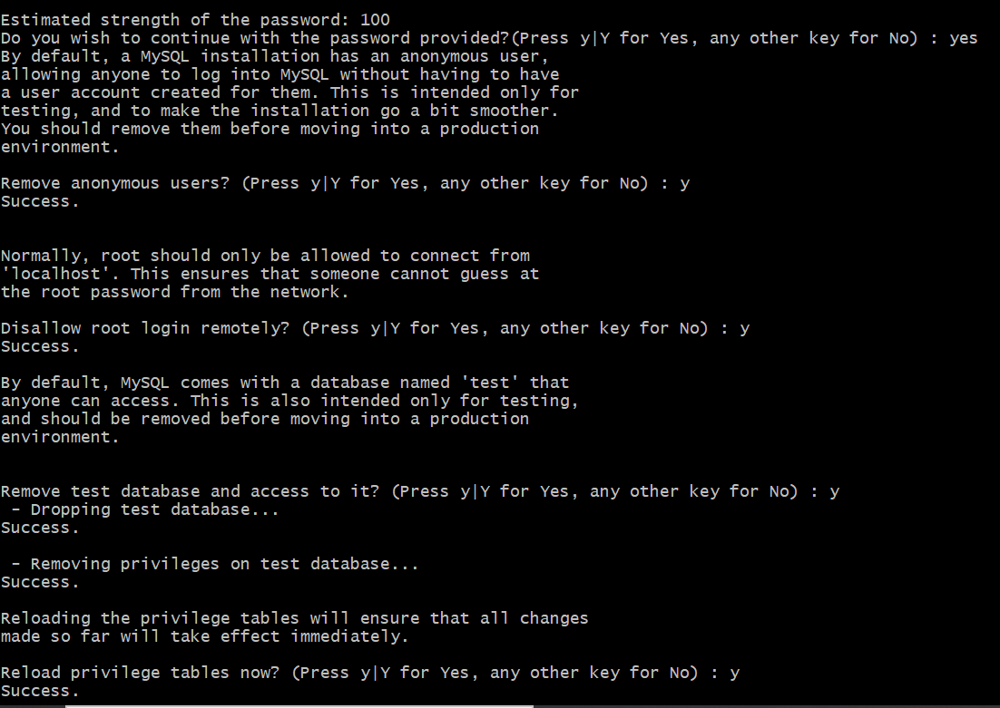

# WEB STACK IMPLEMENTATION IN AWS

## LAMP STACK 

In this Project, we will be implementing Linux, Apache, MySQL, and PHP (LAMP) in six easy steps. 

## Prerequisites 
- An AWS Account 
- Basic understanding of Linux (chown & chmod commands)
- basic text editing skills in vi

### Step 1 - Launch an EC2 Instance

- Launch a new EC2 Instance with t2 micro family and with Ubuntu Server 20.04 LTS

- Create a new keypair - * It is important to save your private key (.pem file) securely *

- ensure you allow ssh traffic into your instance from ** Anywhere ** 

### Connect to your EC2 Instance (using MAC/Linux)

- open your terminal and cd into the directory where your .pem file is saved.
- to avoid a "bad permission" error, change the permissions for the private key file by running:

` sudo chmod 0400 <private-key-name>. pem `

- connect to your instance by running:

` ssh -i <private-key-name>. pem ubuntu@<Public-IP-address> `

Great! We've just launched our instance and connected to it, our set up looks like this now: 

### Step 2 - Installing Apache and updating the firewall

> Install Apache using Ubuntu’s package manager * apt *

- update a list of packages in package manage by running

`sudo apt update`

- run apache2 package installation 

`sudo apt install apache2`

- To verify that apache2 is running as a Service in our OS, use following command

`sudo systemctl status apache2`

*if it is green and running, then you did everything correctly - Yaay! You have just launched your first Web Server in the Clouds*

Before we can receive any traffic by our Web Server, we need to open TCP port 80 which is the default port that web browsers use to access web pages on the Internet

- To do this, we need to go back to our AWS console and add a rule to our EC2 instance configuration to open inbound connection through port 80:

Our server is running and we can access it locally and from the Internet *(Source 0.0.0.0/0 means ‘from any IP address’)*.

Now let us check how we can access our server locally in our Ubuntu shell, run:

`curl http://localhost:80`

You should get something like this:

Now it is time for us to test how our Apache HTTP server can respond to requests from the Internet. Open a web browser of your choice and try to access following url http://<Public-IP-Address>:80

Your browser should look like this:

## Step 3 - Installing MySQL

Now that we have a web server up and running, we need to install a Database Management System (DBMS) to be able to store and manage data for our site in a relational database.

- to install the software, run: 

`sudo apt install mysql-server`

- When prompted, confirm installation by typing Y, and then ENTER.

- When the installation is finished, log in to the MySQL console by typing:

`sudo my sql`

*It’s recommended that you run a security script that comes pre-installed with MySQL. This script will remove some insecure default settings and lock down access to your database system. Before running the script, you will set a password for the root user, using mysql_native_password as default authentication method. We’re defining this user’s password as PassWord.1.*

- Exit the MySQL shell with:

- Start the interactive script by running:

`sudo mysql_secure_installation`

- Answer Y for yes, or anything else to continue without enabling.

*If you answer “yes”, you’ll be asked to select a level of password validation. Keep in mind that if you enter 2 for the strongest level, you will receive errors when attempting to set any password which does not contain numbers, upper and lowercase letters, and special characters, or which is based on common dictionary words e.g., PassWord.1*

*For the rest of the questions, press Y and hit the ENTER key at each prompt. This will prompt you to change the root password, remove some anonymous users and the test database, disable remote root logins, and load these new rules so that MySQL immediately respects the changes you have made.*

- Now log in to the MySQL console by typing:

`sudo mysql -p`

- To exit the MySQL console, type `exit`

Great! MySQL server is now installed and secured. In the next step, we will install PHP, the final component in the LAMP stack.

## Step 4 - Installing PHP 

## Step 5 - Creating a virtual host for our website using apache

## Step 6 - Enabling PHP on the website 

