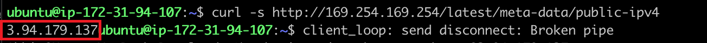

# WEB STACK IMPLEMENTATION IN AWS

## LEMP STACK 

In this Project, we will be implementing Linux, Nginx, MySQL, and PHP (LEMP) in seven easy steps. 

## Prerequisites 

To do this project, we need the following: 

- An AWS Account 
- Basic understanding of Linux (chown & chmod commands)
- Basic text editing skills in vi


### STEP 1 - LAUNCH A NEW EC2 INSTANCE 

- Launch a new EC2 Instance with t2 micro family and with Ubuntu Server 20.04 LTS
- Create a new keypair - *It is important to save your private key (.pem file) securely*
- ensure you allow ssh traffic into your instance from **Anywhere**

#### Connect to your EC2 Instance (MAC/Linux)

- open your terminal and cd into the directory where your .pem file is saved.
- to avoid a "bad permission" error, change the permissions for the private key file by running:

`sudo chmod 0400 <private-key-name>.pem`

- connect to your instance by running:

`ssh -i <private-key-name>.pem ubuntu@<Public-IP-address>`


Great! We've just launched our instance and connected to it.

### STEP 2 - INSTALLING THE NGINX WEB SERVER

We'll be using the *apt* package manager to install our Nginx package. 

- firstly, we'll start off by updating our server's package index with: `sudo apt update`
- Now we can install Nginx with: `sudo apt install nginx`
- When prompted, enter Y to confirm that you want to install Nginx


Once the installation is finished, the Nginx web server will be active and running on your Ubuntu 20.04 server.

- To verify that nginx was successfully installed and is running as a service in Ubuntu, run:

`sudo systemctl status nginx`

If it is green and running, then you did everything correctly – you have just launched your first Web Server in the Clouds!


However, before we can receive any traffic by our Web Server, we need to open TCP port 80 which is default port that web browsers use to access web pages in the Internet.

- To do this, we need to go back to our AWS console and add a rule to our EC2 instance configuration to open inbound connection through port 80.


Our server is running and we can access it locally and from the Internet

- First, let us try to check how we can access it locally in our Ubuntu shell, run:

```
curl http://localhost:80
or
curl http://127.0.0.1:80
```

Either of the command should output this: 


Now it is time for us to test how our Nginx server can respond to requests from the Internet.
- Open a web browser of your choice and input the following url:

`http://<Public-IP-Address>:80`


*Another way to retrieve your Public IP address, other than to check it in AWS Web console, is to use following command:*

`curl -s http://169.254.169.254/latest/meta-data/public-ipv4`



Great! Our web server is now correctly installed and accessible through our firewall.

### STEP 2 - INSTALLING MYSQL


### STEP 3 - INSTALLING PHP

### STEP 4 - CONFIGURING NGINX TO USE PHP PROCESSOR

### STEP 5 - TESTING PHP WITH NGINX

### STEP 6 - RETRIEVING DATA FROM MYSQL DATABASE WITH PHP