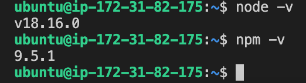
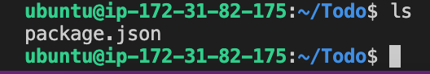
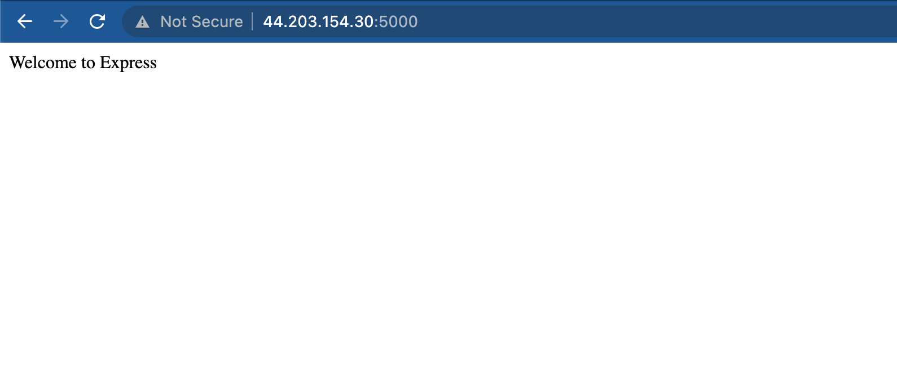
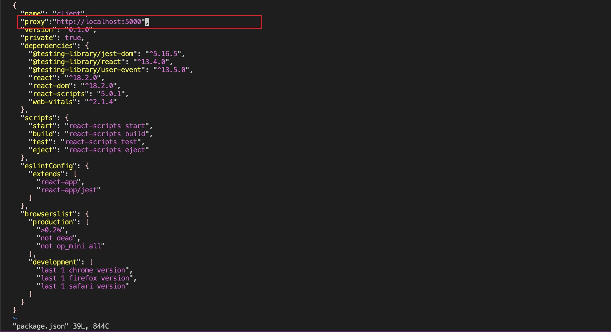
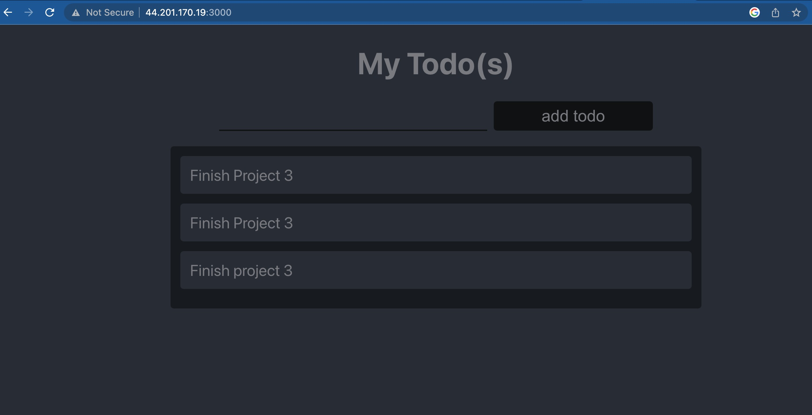

# WEB STACK IMPLEMENTATION IN AWS

## MERN STACK
In this project, we will be implementing a web solution based on MERN stack in AWS Cloud.

### MAERN Web stack consists of the following compenents:

- MongoDB
- ExpressJS
- ReactJS
- Node.js

## Prerequisites 

To do this project, we need the following: 

- An AWS Account 
- Basic understanding of Linux (chown & chmod commands)
- Basic text editing skills in vi

### STEP 1 - LAUNCH A NEW EC2 INSTANCE 

- Launch a new EC2 Instance with t2 micro family and with Ubuntu Server 20.04 LTS
- Create a new keypair - *It is important to save your private key (.pem file) securely*
- ensure you allow ssh traffic into your instance from **Anywhere**

#### Connect to your EC2 Instance (MAC/Linux)

- open your terminal and cd into the directory where your .pem file is saved.
- to avoid a "bad permission" error, change the permissions for the private key file by running:

`sudo chmod 0400 <private-key-name>.pem`

- connect to your instance by running:

`ssh -i <private-key-name>.pem ubuntu@<Public-IP-address>`

Great! We've just launched our instance and connected to it.

## BACKEND CONFIGURATION
### STEP 2 - INSTALLING NODE.JS

- firstly, we need to update and upgrade ubuntu by running the following commands:

`sudo apt update`

`sudo apt upgrade`

- Now, let's get the location of Node.js software from Ubuntu repositories. Run:

`curl -fsSL https://deb.nodesource.com/setup_18.x | sudo -E bash -`


- Install Node.js and npm with the following command:

`sudo apt-get install -y nodejs`

*Note - The command above installs both nodejs and npm.*

*NPM is a package manager for Node like apt for Ubuntu, it is used to install Node modules & packages and to manage dependency conflicts.*

- Verify the package installations by running `node -v` and `npm -v`



##### Nowe we can proceed to our Application Code Setup

- Create a new directory for the To-Do project: `mkdir Todo`

- Run `ls` to confirm that the Todo directory has been created. 



- Change your current directory to the newly created directory: `cd Todo`

- Next, we will need to initialise our project, so that a new fiile 'package.json' will be created. *Follow the prompts after running the command. You can press Enter several times to accept default values, then accept to write out the package.json file by typing yes.*

`npm init`


### STEP 3 - INSTALLING EXPRESSJS

- Install expressjs by using npm: 

`npm install express`


- Now create a file index.js: `touch index.js`

- Install the *dotenv* module by running:

`npm install dotenv`


- Open the index.js file: `vi index.js`

- Paste the code below into it and save: 

```
const express = require('express');
require('dotenv').config();

const app = express();

const port = process.env.PORT || 5000;

app.use((req, res, next) => {
res.header("Access-Control-Allow-Origin", "\*"); res.header("Access-Control-Allow-Headers", "Origin, X-Requested-With, Content-Type, Accept");
next();
});

app.use((req, res, next) => {
res.send('Welcome to Express');
});

app.listen(port, () => {
console.log(`Server running on port ${port}`)
});
````

*Note - We have specified to use port 5000 in the code as this will be required later when we go on the browser*

- Now it is time to start our server to see if it works. Open your terminal in the same directory as your index.js file and type:

`node indexjs`

*if everything goes well, you should see Server running on port 5000 in your terminal*


- Now we need to go back to our AWS Console and open port 5000 in our EC2 Security Groups. 

*Ensure your inbound rules look like this:*


- Open your browser and try to access your server's Public IP or Public DNS name followed by port 5000

`http://<PublicIP-or-PublicDNS>:5000`

*You should see this:*



Quick reminder how to get your server’s Public IP and public DNS name:
- You can find it in your AWS web console in EC2 details
- Run `curl -s http://169.254.169.254/latest/meta-data/public-ipv4` for Public IP address or `curl -s http://169.254.169.254/latest/meta-data/public-hostname` for Public DNS name.

### STEP 3 - ROUTES AND MODELS

#### Routes 

There are three actions that our To-Do application needs to be able to do:

- Create a new task
- Display list of all tasks
- Delete a completed task

*Each task will be associated with some particular endpoint and will use different standard HTTP request methods: POST, GET, DELETE.
For each task, we need to createroutesthat will define various endpoints that the To-do app will depend on.*

- Create a folder called routes: `mkdir routes`

- Change directory to routes folder: `cd routes`

- Create a file called api.js: `touch api.js`

- Open the file with the following command: `vi api.js`

- Copy the code below into the api.js file:

```
const express = require ('express');
const router = express.Router();

router.get('/todos', (req, res, next) => {

});

router.post('/todos', (req, res, next) => {

});

router.delete('/todos/:id', (req, res, next) => {
 })

module.exports = router;
```

#### Models

*Since the app is going to make use of Mongodb which is a NoSQL database, we need to create a model.*

*A model is at the heart of JavaScript based applications, and it is what makes it interactive.*

*We will also use models to define the database schema. This is important so that we will be able to define the fields stored in each Mongodb document.*

*Schema is a blueprint of how the database will be constructed, including other data fields that may not be required to be stored in the database. These are known as **virtual properties**.*

*To create a Schema and a model, install mongoose which is a Node.js package that makes working with mongodb easier.*

- Change the directory back to the Todo folder with `cd ..` and install Mongoose by running:

`npm install mongoose`


- Create a new folder: `mkdir models`

- Change directory into the newly created folder with `cd models`

- Inside the models folder, create a file and name it todo.js `touch todo.js`

*Tip - All three commands above can be defined in one line to be executed consequently with help of && operator `mkdir models && cd models && touch todo.js`*

- Open the file created with `vi todo.js` and paste the following lines of code in the file:

```
const mongoose = require('mongoose');
const Schema = mongoose.Schema;

//create schema for todo
const TodoSchema = new Schema({
action: {
type: String,
required: [true, 'The todo text field is required']
}
})

//create model for todo
const Todo = mongoose.model('todo', TodoSchema);

module.exports = Todo;
```

*Now we need to update our routes from the file api.js in the routes directory to make use of the new model.*

- In Routes directory, open api.js with `vi api.js`

- Delete the code inside the fie with `:%d` and paste the following lines of code into it: 

```
const express = require ('express');
const router = express.Router();
const Todo = require('../models/todo');

router.get('/todos', (req, res, next) => {

//this will return all the data, exposing only the id and action field to the client
Todo.find({}, 'action')
.then(data => res.json(data))
.catch(next)
});

router.post('/todos', (req, res, next) => {
if(req.body.action){
Todo.create(req.body)
.then(data => res.json(data))
.catch(next)
}else {
res.json({
error: "The input field is empty"
})
} });

router.delete('/todos/:id', (req, res, next) => {
Todo.findOneAndDelete({"_id": req.params.id})
.then(data => res.json(data))
.catch(next)
})

module.exports = router;
```

- Save and exit the file. 

### STEP 4 - MONGODB DATABASE 

- Now we need a database where we will store our data. For this, we will make use of mLab. 

*mLab provides MongoDB database as a service solution (DBaaS). You need to signup for a shared clusters free account, which is ideal for our use case.* [sign up here](https://www.mongodb.com/atlas-signup-from-mlab) 

*Follow the sign up process, select AWS as the cloud provider, and choose a region near you.*


- complete the get started checklist as shown on the images below: 

- Allow access to the MongoDB database from anywhere. *Note that this is not secure but it is ideal for testing.*

*Make sure you change the time of deleting the entry from 6 Hours to 1 Week. 


- Create a MongoDB database and collection inside mLab


*You will recall that in the ***index.js*** file, we specified ***process.env*** to access environment variables, but we have not yet created this file. So we need to do that now.*

- Create a file in your ***Todo*** directory and name it ***.env***

```
touch .env
vi .env
```

- Add the connection string to access the database in it, just as below:
```
DB =
'mongodb+srv://<username>:<password>@<network-address>/<dbname>?retryWrites=true&w=majority'
```
*Ensure to update <username>, <password>, <network-address> and <database> according to your setup*

***Here is how to get your connection string***

- Now we need to update theindex.jsto reflect the use of .env so that Node.js can connect to the database.Simply delete existing content in the file, and update it with the entire code below:

```
const express = require('express');
const bodyParser = require('body-parser');
const mongoose = require('mongoose');
const routes = require('./routes/api');
const path = require('path');
require('dotenv').config();

const app = express();

const port = process.env.PORT || 5000;

//connect to the database
mongoose.connect(process.env.DB, { useNewUrlParser: true, useUnifiedTopology: true })
.then(() => console.log(`Database connected successfully`))
.catch(err => console.log(err));

//since mongoose promise is depreciated, we overide it with node's promise
mongoose.Promise = global.Promise;

app.use((req, res, next) => {
res.header("Access-Control-Allow-Origin", "\*");
res.header("Access-Control-Allow-Headers", "Origin, X-Requested-With, Content-Type,
Accept");
next();
});

app.use(bodyParser.json());

app.use('/api', routes);

app.use((err, req, res, next) => {
console.log(err);
next();
});

app.listen(port, () => {
console.log(`Server running on port ${port}`)
});
```

*Using environment variables to store information is considered more secure and best practice to separate configuration and secret data from the application, instead of writing connection strings directly inside the index.js application file.*

- Start your server using the command `node index.js`

- You should see the message **Database connected sucessfully**, if so - great! we have our backend configured. Now we are going to test it.


### TESTING THE BACKEND CODE

*So far we have written backend part of our To-Do application, and configured a database, but we do not have a frontend UI yet. We need ReactJS code to achieve that. But during development, we will need a way to test our code using RESTfulL API. Therefore, we will need to make use of some API development client to test our code.*

*In this project, we will make use of [Postman](https://www.postman.com/downloads/)*

*We will test all the API endpoints and make sure they are working as expected. For the endpoints that require body, we will send JSON back with the necessary fields since it’s what we setup in our code.*

- Now open your Postma, create a **POST** request to the API `http://<PublicIP-or-PublicDNS>:5000/api/todos`. This request sends a new task to our To-Do list so the application could store it in the database. 

***Note: make sure you set header key Content-Type as application/json***


- Create a GET request to your API on `http://<PublicIP-or-PublicDNS>:5000/api/todos`. This request retrieves all existing records from our To-do application (backend requests these records from the database and sends it back as a response to the GET request)


- DELETE request to delete a task from our To-Do list.


**Now we have tested backend part of our To-Do application and have made sure that it supports all three operations we wanted:**

1. Display a list of tasks – HTTP GET request
2. Add a new task to the list – HTTP POST request
3. Delete an existing task from the list – HTTP DELETE request


### STEP 5 - FRONTEND CREATION

Now that we are done with the functionality we want from our backend and API, it is time to create a user interface for a Web client (browser) to interact with the application via API.

***To start out with the frontend of the To-do app, we will use the create-react-app command to scaffold our app.***

- In the same root directory as your backend code, which is the Todo directory, run:

`npx create-react-app client`

*This will create a new folder in your Todo directory called client, where you will add all the react code.*

**Running a React App**
*Before testing the react app, there are some dependencies that need to be installed.*

- Install concurrently - It is used to run more than one command simultaneously from the same terminal window.  
`npm install concurrently --save-dev`
  
- Install nodemon - It is used to run and monitor the server. If there is any change in the server code, nodemon will restart it automatically and load the new changes.
`npm install nodemon --save-dev`


- In the Todo folder open the package.json file and change the highlighted part of the code in the image below and replace it with the following code:

```
"scripts": {
"start": "node index.js",
"start-watch": "nodemon index.js",
"dev": "concurrently \"npm run start-watch\" \"cd client && npm start\""
},
```


- You should have this: 


We now need to configure proxy in the package.json file
- Change the directory to 'client' `cd client` and open the package.json file `vi package.json`.

- Add the key value pair in the package.json file "proxy": "http://localhost:5000"



*The whole purpose of adding the proxy configuration above is to make it possible to access the application directly from the browser by simply calling the server url like http://localhost:5000 rather than always including the entire path like http://localhost:5000/api/todos*

- Now, ensure you are inside the Todo directory and run `npm run dev`


Your app should open and start running on ec2 ip address:3000


***Important note:** In order to be able to access the application from the Internet we have to open TCP port 3000 on EC2 by adding a new Security Group rule.*

**Creating the React Components**

*One of the advantages of react is that it makes use of components, which are reusable and also makes code modular. For our Todo app, there will be two stateful components and one stateless component.*

- From the Todo directory run `cd client`

- move to the src directory - `cd src`

- Inside the src folder create aother folder called *components* `mkdir components`

- Move into the components directory - `cd components`

- Inside ‘components’ directory create three files Input.js, ListTodo.js and Todo.js.

    `touch Input.js ListTodo.js Todo.js`

- Open Input.js file `vi Input.js`

- Copy and paste the following code: 

```
import React, { Component } from 'react';
import axios from 'axios';

class Input extends Component {

state = {
action: ""
}

addTodo = () => {
const task = {action: this.state.action}

    if(task.action && task.action.length > 0){
      axios.post('/api/todos', task)
.then(res => {
          if(res.data){
            this.props.getTodos();
            this.setState({action: ""})
          }
})
        .catch(err => console.log(err))
    }else {
      console.log('input field required')
    }
    
}

handleChange = (e) => {
this.setState({
action: e.target.value
})
}

render() {
let { action } = this.state;
return (
<div>
<input type="text" onChange={this.handleChange} value={action} />
<button onClick={this.addTodo}>add todo</button>
</div>
)
}
}

export default Input
```

- To make use of [Axios](https://axios-http.com/) which is a Promise based HTTP client for the browser and node.js, you need to cd into your client from your terminal and run yarn add axios or npm install axios.

- Move to the src folder and open the clients folder

- Install Axios by running `npm install axios`

- Go to *components directory* `cd src/components`

- Now open your ListTodo.js file `vi ListTodo.js`

- Copy and paste the following code:

```
import React from 'react';

const ListTodo = ({ todos, deleteTodo }) => {

return (
<ul>
{
todos &&
todos.length > 0 ?
(
todos.map(todo => {
return (
<li key={todo._id} onClick={() => deleteTodo(todo._id)}>{todo.action}</li>
)
})
)
:
(
<li>No todo(s) left</li>
)
}
</ul>
)
}

export default ListTodo
```

- Then in the Todo.js file, paste the following code:
```
import React, {Component} from 'react';
import axios from 'axios';

import Input from './Input';
import ListTodo from './ListTodo';

class Todo extends Component {

state = {
todos: []
}

componentDidMount(){
this.getTodos();
}

getTodos = () => {
axios.get('/api/todos')
.then(res => {
if(res.data){
this.setState({
todos: res.data
})
}
})
.catch(err => console.log(err))
}

deleteTodo = (id) => {

    axios.delete(`/api/todos/${id}`)
      .then(res => {
        if(res.data){
          this.getTodos()
} })
      .catch(err => console.log(err))

}

render() {
let { todos } = this.state;
    return(
      <div>
        <h1>My Todo(s)</h1>
        <Input getTodos={this.getTodos}/>
        <ListTodo todos={todos} deleteTodo={this.deleteTodo}/>
    </div> 
    )

} 
}

export default Todo;
```

Now we need to make little adjustment to our react code. Delete the logo and adjust our App.js

- Move to the src folder `cd ..`

- Make sure you are in the src folder and run `vi App.js`

- Copy and paste the following lines of code into it:

```
import React from 'react';

import Todo from './components/Todo';
import './App.css';

const App = () => {
return (
<div className="App">
<Todo />
</div> 
);
}

export default App;
```

- After pasting, exit the editor and open the App.css file 

- Paste the following lines of code into App.css

```
.App {
text-align: center;
font-size: calc(10px + 2vmin);
width: 60%;
margin-left: auto;
margin-right: auto;
}

input {
height: 40px;
width: 50%;
border: none;
border-bottom: 2px #101113 solid;
background: none;
font-size: 1.5rem;
color: #787a80;
}

input:focus {
outline: none;
}

button {
width: 25%;
height: 45px;
  border: none;
margin-left: 10px;
font-size: 25px;
background: #101113;
border-radius: 5px;
color: #787a80;
cursor: pointer;
}

button:focus {
outline: none;
}

ul {
list-style: none;
text-align: left;
padding: 15px;
background: #171a1f;
border-radius: 5px;
}

li {
padding: 15px;
font-size: 1.5rem;
margin-bottom: 15px;
background: #282c34;
border-radius: 5px;
overflow-wrap: break-word;
cursor: pointer;
}

@media only screen and (min-width: 300px) {
.App {
width: 80%;
}

input {
width: 100%
}

button {
width: 100%;
margin-top: 15px;
margin-left: 0;
}
}

@media only screen and (min-width: 640px) {
.App {
width: 60%;
}

input {
width: 50%; 
}

button {
width: 30%;
margin-left: 10px;
margin-top: 0;
}
}
```

- Exit the file and open the index.css file. 

- Copy and paste the code below: 

```
body {
margin: 0;
padding: 0;
font-family: -apple-system, BlinkMacSystemFont, "Segoe UI", "Roboto", "Oxygen",
"Ubuntu", "Cantarell", "Fira Sans", "Droid Sans", "Helvetica Neue",
sans-serif;
-webkit-font-smoothing: antialiased;
-moz-osx-font-smoothing: grayscale;
box-sizing: border-box;
background-color: #282c34;
color: #787a80;
}

code {
font-family: source-code-pro, Menlo, Monaco, Consolas, "Courier New",
monospace;
}
```

- Go to the *Todo* directory `cd ../..`

- When you are in the Todo directory run `npm run dev`

Assuming no errors when saving all these files, our To-Do app should be ready and fully functional with the functionality discussed earlier: creating a task, deleting a task and viewing all your tasks.



## Congratulations 

In this mern-project we have made a simple To-Do and deployed it to MERN stack. 

We wrote a frontend application using React.js that communicates with a backend application written using Expressjs. 

We also created a MongoDB backend for storing tasks in a database.